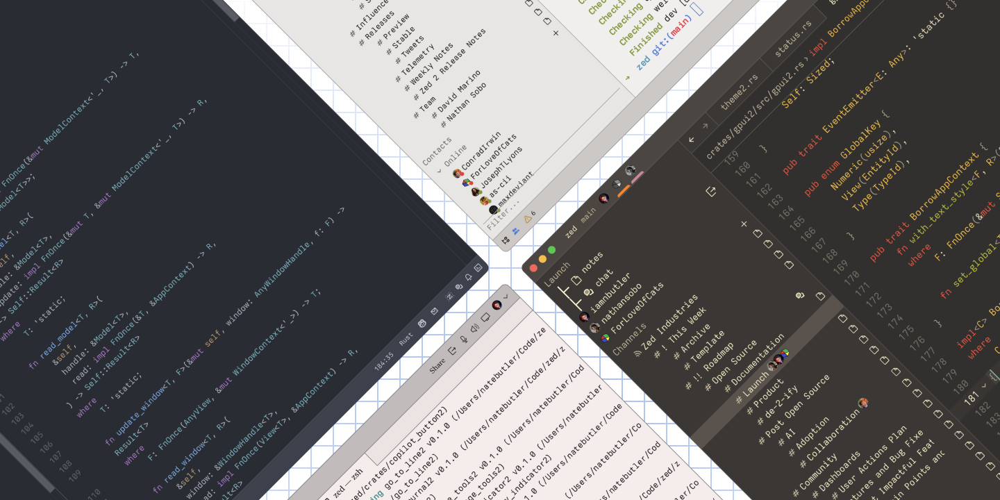
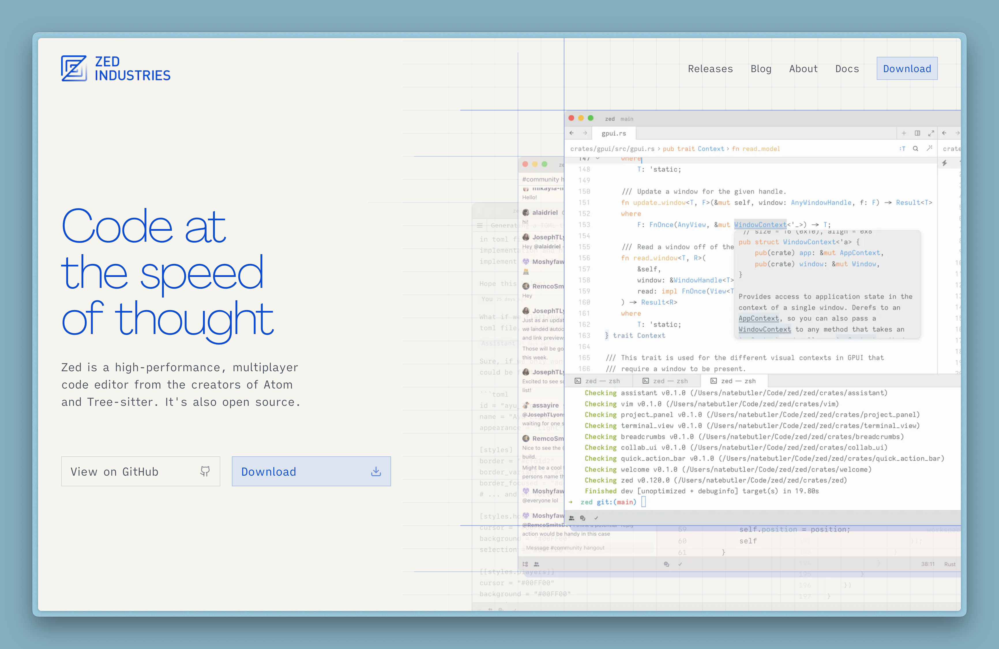

Zed is a new, open-source text editor built in Rust by the team that originally built [Atom](https://atom-editor.cc).

## Blazingly Fast!

The brilliant minds behind Zed also built [GPUI](https://zed.dev/blog/gpui-2-on-preview),
a rendering framework that leverages the GPU to render 2D UI's like a video game.
This gives Zed a snappy and responsive user interface.

*Zed running on GPUI 2, in various themes. [Source](https://zed.dev/blog/gpui-2-on-preview)*

## Useful Built-ins

Zed is all about helping you *"code at the speed of thought"*. So it's got a bunch of cool out-of-the-box tools like Vim, LSP, Tree-sitter, an integrated terminal, and GitHub Copilot. All these features being baked into Zed help you code as efficiently as you possibly can. It also features support for languages and frameworks like TypeScript and Astro!

*Zed.dev by Zed Indsutries [Source](https://zed.dev)*

## Sign Me Up!

Currently, Zed is still in beta and only available on Mac. However, they are working on support for
[Linux](https://github.com/zed-industries/zed/issues/7015) and [Windows](https://github.com/zed-industries/zed/issues/5394).
If you have a compatible device, go check it out at [zed.dev](https://zed.dev)!
