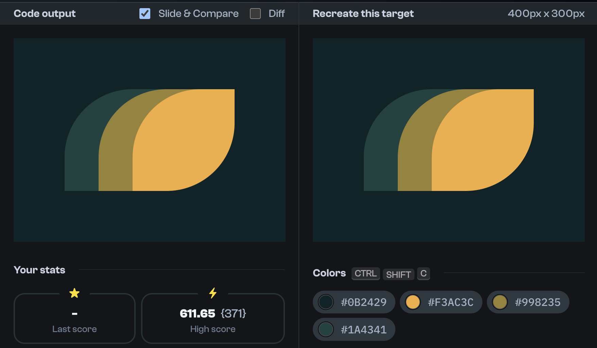
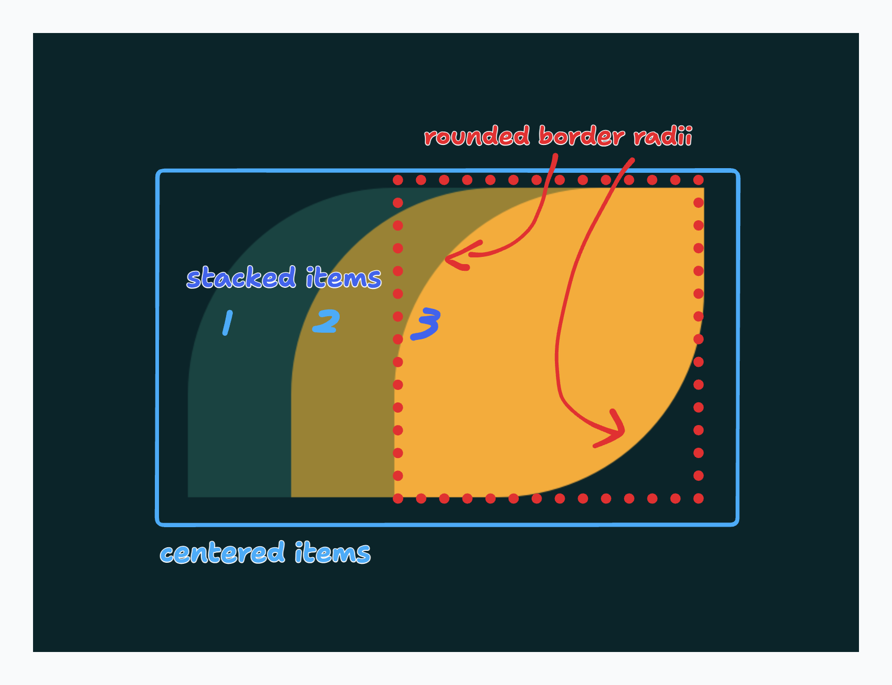

import Aside from '/src/components/Aside.astro'

[CSSBattle.dev](https://cssbattle.dev/) is an awesome website that helps you master concepts like positioning, flex, grid, pseudo-elements, shadows, and a lot more!

<Aside>
**Before we start**: Typically, the best way to add graphics to your site is to use things like images and SVGs.
The challenges presented in CSS Battle are meant to be completed for fun
and to help you improve your understanding of concepts that you can *then*   apply in more realistic use cases.
</Aside>

Taking on any one of the many free and fun challenges they have hosted lets you train your ability to take a design and break it down into parts and requirements. This helps you understand how to structure your markup better.

Once you've got the architecture of the HTML in mind, you can then make use of all the properties that are available in CSS to craft the design. You're gonna be using stuff like `display`, `position`, `margin`, and `background` a lot for these challenges.

  See the Pen <a href="https://codepen.io/brian-pob/pen/JjVoGrw">
  CSS Battle #7</a> by Brian Michael Poblete (<a href="https://codepen.io/brian-pob">@brian-pob</a>)
  on <a href="https://codepen.io">CodePen</a>.

And while it may be impractical to actually create graphics this way, you start to learn how these properties work and how to apply them.

You can check out this particular battle at [this link](https://cssbattle.dev/play/7).
