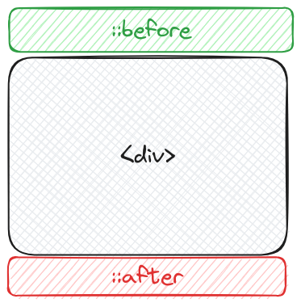

import Aside from '/src/components/Aside.astro';

When styling an element, you may want to add extra style that isn't possible
with just the element itself. But before you add an extra `div` or
`span` to your HTML, consider using a pseudo-element instead to keep your
HTML clean and semantic.

## What are CSS pseudo-elements?

Pseudo-elements are a way to add style to an element that isn't part of the
document tree. They are used to style specific parts of an element, such as the
first letter, first line, or even the space before or after the element

Pseudo-elements are denoted by two colons `::` followed by the name of the
pseudo-element. For example, `::first-line` or `::before`. For this post, we
will focus on the `::before` and `::after` pseudo-elements.

<Aside>
**Note:** You can also use a single colon `:` instead of two colons, but
it is recommended **not** to do this.
Instead, use two colons to avoid confusion with pseudo-classes (e.g.,
`:hover`).
[Link to MDN docs on pseudo-elements vs Pseudo-Classes](https://developer.mozilla.org/en-US/docs/Learn/CSS/Building_blocks/Selectors/Pseudo-classes_and_pseudo-elements)
</Aside>

## What can I do with pseudo-elements?

One way you can think of the `::before` and `::after` pseudo-elements is as if they were
additional stylable elements. This can be useful for adding decorative content, such as
shapes, icons, or text, to an element without adding extra HTML.

  See the Pen <a href="https://codepen.io/brian-pob/pen/ZEZYZeJ">
  pseudo-elements example</a> by Brian Michael Poblete (<a href="https://codepen.io/brian-pob">@brian-pob</a>)
  on <a href="https://codepen.io">CodePen</a>.

---
## References
- [MDN Web Docs: pseudo-elements](https://developer.mozilla.org/en-US/docs/Web/CSS/Pseudo-elements)
- [CSS Tricks: pseudo-elements](https://css-tricks.com/almanac/selectors/a/after-and-before/)
- [Fireship - CSS Pseudo-elements in 100 seconds](https://www.youtube.com/watch?v=e1KpKBHJOrA)